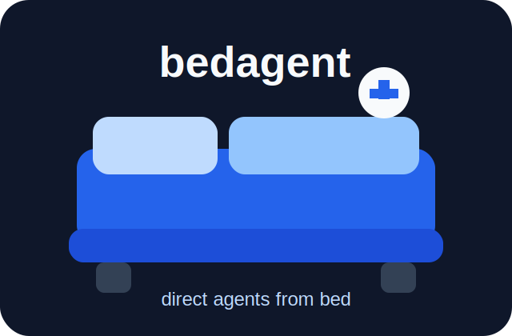

# bedagent



> 我躺着想，Agent 起来干。

bedagent 是给“没有手脚的思想者”准备的 Agent 外骨骼。

这个人可能正躺在床上：不想打字，不想看长屏幕，不想维护复杂流程，但脑子一直在想。bedagent 要接住这些想法，陪他推演，把想法整理成任务，再让 Agent 在安全边界内执行。

## 第一原则

**懒到极致的人是一等公民。**

这不是玩笑，而是产品约束：

- 能语音就不要打字；
- 能短反馈就不要长报告；
- 能自动推进就不要让用户盯着；
- 能在沙盒里试错就不要碰真实世界；
- 只有高风险动作才把人拉回来确认；
- 能剪掉低价值分支就不要浪费注意力。

## 和 sofagent 的关系

sofagent 的哲学是：**让 Agent 守纪律。**

bedagent 继承这个纪律层，但产品重心不同：

| 维度 | sofagent | bedagent |
|------|----------|----------|
| 第一性问题 | Agent 不守规矩怎么办 | 人在床上一直想，但懒得操作怎么办 |
| 核心对象 | Agent 行为 | 思想者的想法到现实 |
| 主要能力 | 纪律、验证、反思、审计 | 捕获、推演、语音、沙盒、短反馈 |
| 隐喻 | 纪律委员 | 思想者外骨骼 |

一句话：

```text
bedagent = sofagent 的纪律层 + 思想捕获 + Agent 大脑 + 执行沙盒 + 低屏幕交互
```

## 核心链路

```text
床上想法
→ Capture 捕获
→ Think 推演沙盒
→ Plan 任务整理
→ Gate 风险闸门
→ Act 执行沙盒
→ Report 短汇报
→ Memory 反思沉淀
```

核心原则是：

> Brain before Hands. 先过脑，再动手。

先允许 Agent 在“脑子里”乱想；再允许它在沙盒里试错；最后才允许它触碰真实世界。

但“想”也不能无限发散。bedagent 的节奏是：

> 想的时候快，剪枝要狠，动手前慢，执行要稳。

## 当前仓库状态

根目录现在是 bedagent 的新产品设计区。历史实现和参考代码放在：

```text
ref/ref_repos/sofagent/              # 上游参考快照
ref/ref_repos/bedagent-bootstrap/    # 早期 bedagent 历史实现快照
```

它们提交在仓库里，方便 GitHub 浏览和 `rg` 搜索，但不再是 active root 的源代码。

## 文档

| 文档 | 说明 |
|------|------|
| [docs/philosophy.md](docs/philosophy.md) | sofagent 与 bedagent 的哲学对比 |
| [docs/laziness-and-pruning.md](docs/laziness-and-pruning.md) | 懒的分型、快速思考与剪枝原则 |
| [docs/research-map.md](docs/research-map.md) | 相关工作研究地图：语音、PKM、Agent、Guardrails、沙盒 |
| [docs/capability-map.md](docs/capability-map.md) | bedagent 应该有哪些功能 |
| [docs/sandbox-brain.md](docs/sandbox-brain.md) | Agent 大脑、推演沙盒、执行沙盒 |
| [docs/voice-control.md](docs/voice-control.md) | 床上低屏幕/语音控制规划 |
| [docs/agent-constraint-frameworks.md](docs/agent-constraint-frameworks.md) | Agent 约束/治理框架调研 |
| [ref/README.md](ref/README.md) | 参考快照目录说明 |

## 不是什么

- 不是另一个通用 Agent 框架；
- 不是聊天机器人；
- 不是单纯语音助手；
- 不是把 sofagent 改名；
- 不是让 Agent 绕过确认去乱干。

bedagent 的目标是：

> 让最懒的思想者，也能安全地指挥最勤快的 Agent。
