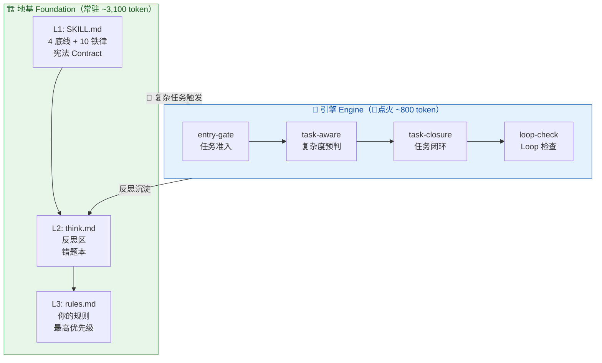

# bedagent

中文 | [English](README.en.md)

[](./LICENSE)
[](./HANDBOOK.md)
[](./README.md)
[](#这是什么)
[](./LIMITATIONS.md#平台依赖)
[](./LIMITATIONS.md#平台依赖)
[](https://github.com/HyperGroups/bedagent/stargazers)


<!-- TODO: demo.gif — 15s 左右对比: 裸 Agent 跑偏 vs bedagent 约束后正常 -->

> bed + agent = 床上特工——希望有一天，我们能躺在床上，Agent 就把活干完了。
> v0.91 · 2026-06-25

> 📄 **License**：MIT。代码、文档、模板——随便用，保留版权声明就行。

bedagent 参考 [sofagent](https://github.com/HyperGroups/sofagent) 的主体思想：给 Agent 加一层跨平台纪律约束，让它先读上下文、再动手、做完验证、失败复盘。区别是产品语义从“躺在沙发上等 Agent 干活”，进一步收敛成“躺在床上指挥智能体把活干了”。

**懒到极致的人是一等公民。** bedagent 默认用户不想盯屏幕、不想反复打字、不想读长日志、不想维护复杂工作流。产品设计要先服务这种人：一句话派活、短反馈确认、能语音就语音、能自动推进就自动推进；只有遇到高风险动作时，才把用户拉回来确认。

这个仓库是 bed 主题的派生实现：核心仍是 **4 底线 + 10 铁律 + 三层加载链 + 反思循环 + 可选编排/审计**。上游历史文档和实验记录保留为设计证据，bedagent 自己的社区数据还需要后续补充。

如果你也想少坐在电脑前盯循环，多把任务交给 Agent，可以把 bedagent 当成一套“床头遥控器”：先规定 Agent 怎么干，再让它自己推进，最后用日志和审计看它有没有守规矩。

> 💡 派生说明：bedagent 继承 sofagent 的 MIT 许可与设计脉络，改名、路径、命令、数据目录和文档入口已切换为 bedagent。

---

## 这是什么

当你的 Agent 改代码不看上下文、做完了不验证、同一个坑反复踩——bedagent 能约束其工作习惯、从错误中沉淀教训。

给 Agent 配了个 🎖️「纪律委员」：不是让它更聪明，是让它守规矩。

> **平台差异**：OpenClaw 上完整生效（编排 + Hook + 断路器）；WorkBuddy / Codex / Claude Code / Hermes Agent 上仅宪法层约束生效（先读后写/验证再干/谨慎修改），治理加固全部降级或失效——非 OpenClaw 平台价值约完整版的 30%。其他平台建议用 `--lite` 安装。详见 [平台能力表](#平台能力)。

> **v0.85 定位校准**：v0.84 的 5 组 A/B 数据告诉我们，bedagent 的真正价值不在安全约束（模型和平台已覆盖 90%），而在**纪律**——先读后写、验证再干、谨慎修改。独立测试者报告纪律性 +2、首次通过率 +40%。但这份数据有方法论局限（知识传递效应未排除），我们在 v0.85 设计了严格实验来证实或证伪（[详见 v0.85 开发日志](./docs/changelog/v0.85.md)）。
>
> 从「治理层」改为「纪律层」，不是因为治理层错了——治理层是长期目标。是因为**当前被验证的差异化在纪律层**，我们不想用一个大词掩盖一个还没证实的小结果。如果你是老用户，加载链、宪法、反思区全部不变——变的是我们怎么定位自己。

### 效果证据状态（v0.85）

> 📌 **这是一个正在收集证据的早期项目，不是生产就绪的工具。**

| 维度 | 数据 | 状态 |
|------|------|:----:|
| 约束层增量 | 1/10（WorkBuddy 对话），0/16（CLI 一击） | 天花板低，被模型安全训练+用户配置文件覆盖 |
| 纪律层增量 | 独立测试者报告 +2/10，首次通过率 +40% | promising 但未排除方法论局限，待反转验证 |
| 非 OpenClaw 平台 | 全功能价值约 30%，4 项治理加固全部降级或失效 | 架构宿命，非 bug |
| 持续使用数据 | 0 个 ≥1 周样本 | 待社区补充 |

| 角色 | 怎么干 |
|------|------|
| **Skill**（判断）| MD 文件当规则书，Agent 加载后照做——三层加载链、复杂度预判、反思沉淀 |
| **脚本**（执行）| bash 脚本处理机械活——读写文件、调 API，Agent 调 shell 跑（非 bash 平台降级为 Read/Edit 工具） |
| **平台兜底**| 加载链 + 断路器 + 死循环检测——OpenClaw 系由 Hook 和配置层兜底，其他平台依赖自身安全机制 |

> 💡 bedagent 是软约束层——靠 Agent 读取并自觉遵守，不是硬编码强制执行。执行率受上下文长度、模型能力影响。详见 [LIMITATIONS.md](./LIMITATIONS.md#known-limits)。

---

## 📖 文档入口

| 你是谁 | 看哪个 | 一句话 |
|------|------|------|
| 普通用户 | [HANDBOOK.md](./HANDBOOK.md)（450 行） | 怎么装、怎么用、什么是铁律 |
| 开发者 | [DEVELOPMENT.md](./DEVELOPMENT.md)（693 行） | Skill 怎么协同、编排怎么跑、反思怎么闭环 |
| 设计爱好者 | [ARCHITECTURE.md](./ARCHITECTURE.md)（385 行） | 为什么选这些设计、已知局限 |
| 企业技术决策者 | [docs/team-deploy.md](./docs/team-deploy.md)（3 页） | 装、试、回顾三阶段落地指南 |
| 低屏幕/语音场景 | [docs/voice-control.md](./docs/voice-control.md) | 躺在床上用语音指挥 Agent 的能力规划 |
| 框架调研 | [docs/agent-constraint-frameworks.md](./docs/agent-constraint-frameworks.md) | 可借鉴的 Agent 约束、Guardrails、HITL、语音框架 |

---

## 怎么工作

| 做什么 | 怎么做 |
|------|------|
| **地基** | 三层加载链——宪法（4底线+10铁律）→ 反思区（自动错题本）→ 你的规则。整个会话期间永远在线 |
| **引擎** | 任务编排引擎——🔴 复杂任务时点火，智能拆解 + Loop 检查 + 闭环反思 |
| **进化** | 渐进减薄——同类任务根据历史成功率调整编排深度，跑崩了恢复完整编排 |

> 💡 核心理念：**厚在治理，薄在复用。** 约束自己定，模板和 Skills 从社区取。**当前被验证的差异化在纪律层（先读后写/验证再干/谨慎修改），不在约束层。** 为 AI Agent 提供纪律层与反思循环（效果待社区验证）。
> 💰 安装成本：约 3,000 token 地基常驻（128K 窗口的 2.5%）。编排引擎仅 🔴 复杂任务时额外 ~800 token。详见 [Token 预算](./HANDBOOK.md#token-预算参考)。

### 概念分层：哪些是核心，哪些是增强

bedagent 聚合了很多概念——宪法、铁律、加载链、编排引擎、断路器、daemon……新用户容易晕。v0.85 把它们拆成两列（来自 DeepSeek 评审「架构概念过载」洞察）：

| 🔧 纪律层核心（所有平台） | 🚀 治理层增强（OpenClaw 专属） |
|------|------|
| 4 底线 + 10 铁律（SKILL.md 宪法）| 编排引擎（ao compose，需 npm） |
| 三层加载链（SKILL → think → rules）| 加载链 Hook 自动注入（非 OpenClaw 靠 Agent 自觉） |
| 反思区（think.md 自动错题本）| 断路器（session 隔离 + circuit breaker） |
| 规则定制（rules.md 你的规则）| 步数闸（MAX+GRACE 两段式） |
| Loop Agent 三节点（全平台通用）| 渐进减薄（orchestrator/ 目录） |
| 文件系统审计（task/logs）| Skill 信任五级 + 引擎自动抓取安全审查（正则+LLM）|

**左侧是 bedagent 的差异化所在**——纪律层（先读后写/验证再干/谨慎修改），不依赖任何平台，所有平台都生效。

**右侧是治理层增强**——让约束自动化、让治理更严密，但只在 OpenClaw 上全绿。非 OpenClaw 平台价值约 30%（只有左侧生效）。详见 [LIMITATIONS.md 平台依赖](./LIMITATIONS.md#平台依赖)。

> 不用 OpenClaw？看左侧就够了。用 OpenClaw？左侧是基础，右侧让基础更牢。

### FDE 场景：为什么前沿部署工程师需要纪律层

> 💡 **FDE（Forward Deployed Engineer）** 是 Anthropic / OpenAI 提出的企业 AI 落地模式——把工程师派到企业现场，将 AI 嵌入业务流程。bedagent 不做 FDE 服务，做 **FDE 手里的纪律工具**。

当 AI Agent 进入企业真实业务，企业技术决策者面对的不是"Agent 能不能干"，而是三个纪律问题：

| FDE 痛点 | bedagent 能力 | 版本 |
|---------|-------------|:----:|
| **外部 Skill 安全吗？** — Agent 自动拉来的社区 Skill 可能藏恶意命令、泄密端点 | Skill 安全审查（22 条正则硬门 + LLM 语义审查软门） | ✅ v0.90 |
| **数据合规吗？** — 企业敏感数据明文落盘，审计不通过 | 数据存储安全声明（明文 + 加密计划 age v1.0+） | ✅ v0.90 |
| **Agent 乱改代码怎么办？** — 没有 review 的 commit 进入生产环境 | 提交时审计 bedagent-audit（看 git diff，不依赖 Agent 配合） | 🔨 v0.91 |
| **跨平台部署一致性？** — 不同企业用不同 Agent 平台 | 纯 MD + bash 跨平台纪律标准（OpenClaw / WorkBuddy / Claude Code / Codex） | ✅ v0.85 |
| **多设备协同治理？** — 团队多台设备的 Agent 经验无法共享 | 多设备协同层（信号共享网络） | 📋 v2.x |

> **当前交付**：v0.91 的 FDE 能力是"安全审查 + 数据声明 + 提交时审计 MVP"三件——审计层完整版（LLM 辅助 + CI gate）在 v0.92，多设备在 v2.x。bedagent 当前是 FDE 场景的**纪律底座**，不是完整的 FDE 解决方案。

### 架构总览



> **已知局限**：核心效果尚无第三方实测数据；复盘是 LLM 自评，无客观基准；Loop Agent 非独立进程；纯文件约束依赖 Agent 配合；数据明文存储（task/logs + think.md 含任务记录，v0.90 不加密，age 加密计划 v1.0+——详见 LIMITATIONS）；不是多用户系统（共享 .bedagent/ 会交叉污染经验）。详见 [LIMITATIONS.md](./LIMITATIONS.md#known-limits)。

## 🖥️ 平台能力

> "兼容"不等于"支持"。核心约束（MD 文件）所有平台可读——这叫兼容。完整治理（编排引擎 + Hook + 断路器 + daemon）只在 OpenClaw 上生效——这叫支持。

| 平台 | 核心约束生效 | 完整治理生效 | 实际价值 |
|------|:---:|:---:|:---:|
| OpenClaw | ✅ 宪法+反思+规则（Hook 自动注入）| ✅ 编排+Hook+断路器+daemon | ~100% |
| WorkBuddy | ✅ 宪法+反思+规则（@skill 加载）| ⚠️ 编排可装但需 npm，Hook/断路器降级 | ~40% |
| Codex / Hermes / Claude Code | ⚠️ 宪法（种子指令手动贴），反思/规则靠 Agent 自觉 | ❌ 全部缺失 | ~30% |

> 📌 CLI one-shot 场景（非交互式）：加载链 0% 生效（Agent 跳过 Read 直接执行），包括 OpenClaw。这是架构宿命，不是 bug。详见 [LIMITATIONS.md](./LIMITATIONS.md#加载链步进脆弱性v060v062-验证结论)。

> **约束级别说明**：步数闸 / 熔断闸 / 幂等检查均为 prompt 级软提醒，非进程级硬拦截——Agent 可能跳过。OpenClaw 上 Hook 可升级为硬拦截。各平台实测数据见 [platform-matrix.md](./docs/platform-matrix.md)。

> 📎 「种子指令」是什么：写在 Agent 记忆文件（如 CLAUDE.md / AGENTS.md / SOUL.md）里的一句话，告诉 Agent 启动时先读 bedagent 约束文件。**这不是自动化——是人手动贴的纸条。** OpenClaw 和 WorkBuddy 通过各自的 skill 机制自动加载，不需要种子指令。

## 实际效果

> **效果？我们诚实地说：方向有了，证据还在补。** v0.84 跑了 5 组 A/B（WorkBuddy 对话 + CLI 一击两轮 + 独立测试者代码重构），约束层增量天花板低（被三层压缩），纪律层有 promising 信号但存在方法论局限。v0.85 设计了 45 组对照实验来证实或证伪——详见 [开发日志](./docs/changelog/v0.85.md)。

> 详见 [EVIDENCE.md](./docs/EVIDENCE.md)——社区用户的实际使用数据。

---

## 新方向：提交时审计

v0.85 确立的新主线方向——**从运行时治理（预防）转向提交时审计（检测）**。

当前架构依赖 Agent 配合读取 MD 文件——不配合就全失效（CLI 0/16）。审计方向不依赖 Agent 配合，看的是已经发生的 git diff：

```bash
# v0.91 MVP（v0.85 只确立方向）
bedagent-audit --diff HEAD~1..HEAD --task "任务描述"

❌ 铁律 #1 先读再用：handler.ts 被修改，但修改前无 Read 记录
✅ 铁律 #3 验证再干：package.json 修改后有 npm test 记录
⚠️ 铁律 #7 谨慎修改：本次 diff 修改了 3 个不在任务范围内的文件
```

> 💡 为什么不依赖 Agent 配合就是杀手级：(1) 看的是 git diff，Agent 没法绕过；(2) 跨平台，任何 git 仓库都能跑；(3) 确定性输出 exit code，不是 LLM 评分。

> 这不意味着放弃运行时治理——两者互补。运行时治理减少问题发生，提交时审计兜底检测漏网之鱼。

---

## 不是什么

- ❌ 不是 AI 框架——不管模型 API、不写 prompt，那是 Model 层的事
- ❌ 不是 Skills 商店——不维护可复用 Skills（内置 task-aware 等核心治理 Skill 除外），外部 Skills 从社区获取
- ✅ 是一套**跨平台纪律标准**——像 .editorconfig 之于编辑器，不是最强大的，但是唯一跨平台的。靠 Skill + 脚本 + 配置三层落地，告诉 Agent 什么能做、什么不能做、什么时候该收手。OpenClaw first，其他平台仅宪法层约束

---

## Quick Start

> 选你的平台，5 步，10 分钟。

### ⚡ 快速体验（仅宪法层，30 秒）

只想试试 bedagent 的核心约束？不需要完整安装：

```bash
bash bedagent/scripts/install.sh --lite
```

装完你会得到：宪法（4 底线 + 10 铁律）+ 反思区模板（think.md）+ 规则模板（rules.md）。编排引擎、daemon、脚本工具都不装——降 80% 复杂度，保 60% 价值。非 OpenClaw 平台推荐先用 Lite。

### 🚀 完整安装（两步）

```bash
git clone https://github.com/HyperGroups/bedagent.git
cd bedagent && bash bedagent/scripts/install.sh
```

> 自动探测平台。也可以用一行命令（`curl -fsSL ... | bash`），但企业环境推荐 git clone——代码可审计。

如果你已安装 ClawHub CLI 或 SkillHub CLI，一行命令即可：

```bash
# ClawHub
clawhub skill install HyperGroups/bedagent

# SkillHub
skillhub install bedagent
```

> 💡 没有 ClawHub CLI？继续往下走 git clone 安装流程，一样简单。

### 1. 前置依赖

| 依赖 | 版本要求 | 为什么需要 | 检查命令 |
|------|------|------|------|
| bash | ≥4 | install.sh / task-record.sh | `bash --version` |
| git | 任意 | clone 仓库、task/logs 追溯、worktree 隔离 | `git --version` |
| node | ≥18 | `ao compose` 编排引擎（agency-orchestrator）| `node --version` |
| npm | ≥9 | 全局安装 agency-orchestrator | `npm --version` |

> 💡 WorkBuddy 用户若不跑编排引擎（只用宪法层约束），node/npm 可不带——v0.85 起 `--no-ao` 升为非 OpenClaw 平台的推荐默认路径。OpenClaw 跑复杂任务（🔴）需 node + npm。

> 📌 **编排引擎是可选增强，不是核心依赖**。核心约束层（宪法 + 反思 + 规则）零外部依赖。编排引擎依赖第三方 npm 包 `agency-orchestrator`——v0.84 A/B 数据表明编排不是当前差异化所在，v0.85 将其从"核心功能"降级为"OpenClaw 增强项"。详见 [v0.85 开发日志](./docs/changelog/v0.85.md#编排引擎降级)。

### 2. 安装

```bash
bash bedagent/scripts/install.sh --platform 你的平台
```

| 平台 | 命令 | 说明 |
|------|------|------|
| **OpenClaw** | `bash bedagent/scripts/install.sh` | 自动探测，完整部署（宪法 + Hook + 断路器） |
| **WorkBuddy** | `bash bedagent/scripts/install.sh --platform workbuddy` 或通过技能市场安装 | 部署 SKILL.md 到 `~/.workbuddy/skills/bedagent/` |
| **Claude Code** | `bash bedagent/scripts/install.sh --platform claude` | 部署宪法 + 输出种子指令（需手动粘贴到 CLAUDE.md） |
| **Codex** | `bash bedagent/scripts/install.sh --platform codex` | 部署宪法 + 输出种子指令（需手动粘贴到 AGENTS.md） |
| **Hermes Agent** | `bash bedagent/scripts/install.sh --platform hermes` | 部署宪法 + 输出种子指令（需手动粘贴到 SOUL.md） |

> 未指定 `--platform` 时自动探测。install.sh 会根据平台写入对应目录（OpenClaw→`~/.openclaw/skills/`，WorkBuddy→`~/.workbuddy/skills/`，其他平台输出种子指令）。

### 3. 30 秒 smoke test

```bash
bash bedagent/scripts/verify.sh
```

> 预期：9 类 24+ 检查项全 pass。加 `--json` 可集成到 CI/CD。如果 fail，看 [Handbook §六](./HANDBOOK.md#六常见问题) 排查。

### 4. 跑第一个任务

打开你的 Agent 客户端，试一个需要多步拆解的任务（这样才能看出 bedagent 的编排能力）：

> `/goal` 是 Claude Code 的自主执行命令；OpenClaw 用户可直接描述复杂任务，Agent 会自动触发编排引擎。详见 [Handbook §四](./HANDBOOK.md#四任务目标制定)。

```
/goal 帮我分析一下这个项目的代码质量，生成一份改进建议报告
```

Agent 会自动拆解任务 → 匹配 Skill → 执行 → 反思沉淀。在 OpenClaw 上全程自动；在其他平台部分能力需手动触发（详见 [LIMITATIONS.md 平台依赖](./LIMITATIONS.md#平台依赖) 能力表）。

跑完看结果：

```bash
ls .bedagent/task/logs/        # 按「年-月」分目录的执行日志
cat .bedagent/think.md         # Agent 自动提炼的反思摘要
```

OpenClaw 上全自动，其他平台需手动触发闭环。

---

**跑通了？** [HANDBOOK.md](./HANDBOOK.md) 教你怎么调，[DEVELOPMENT.md](./DEVELOPMENT.md) 讲内部怎么跑，[ARCHITECTURE.md](./ARCHITECTURE.md) 说为什么这么设计。想看这个项目怎么开发的？[开发日志](./docs/changelog/) 是作者的 dogfooding 实录。

---

## 项目结构

```
bedagent/                  ← 核心部署文件（SKILL.md 主入口 + 5 子 Skill + 脚本 + hook）
├── README / HANDBOOK / DEVELOPMENT / ARCHITECTURE / ROADMAP.md  ← 文档
├── docs/                  ← EVIDENCE / TESTING / changelog / cases
```

安装后自动生成 `.bedagent/`（think.md 反思 + task/logs 审计 + orchestrator/ 配置），每次任务自动记录，跨任务反思沉淀。

---

## 用了哪些外部项目

| 依赖 | 干什么 |
|------|------|
| [OpenClaw](https://github.com/openclaw/openclaw) | Agent 运行时——加载链、Hook、Session 管理 |
| [agency-orchestrator](https://github.com/jnMetaCode/agency-orchestrator)（Apache-2.0） | 任务编排引擎——`ao compose` 一行拆任务、匹配角色 |
| [agency-agents-zh](https://github.com/jnMetaCode/agency-agents-zh) | 角色模板来源 |
| [ClawHub](https://clawhub.ai) / 各平台技能市场 | 外部 Skills 的发现来源——不内置，按需从社区获取 |

---

## 🤝 贡献

欢迎提 Issue 和 PR，尤其是挑刺的那种。详见 [CONTRIBUTING.md](./CONTRIBUTING.md)。

> 🧑‍💻 **我们在寻找 Co-maintainer**——特别是熟悉 bash BSD/macOS 兼容性、OpenClaw hook(TS)、安全审计或英文文档的人。从第一个 PR 开始，贡献自然累积，作者主动邀请。详见 [CONTRIBUTING.md § Seeking Co-maintainers](./CONTRIBUTING.md#seeking-co-maintainers)。

---

## 致谢

- [OpenClaw](https://github.com/openclaw/openclaw) by Peter Steinberger — bedagent 的基石
- [DeepSeek V4 Pro](https://api-docs.deepseek.com/zh-cn/) + [GLM-5.2](https://z.ai/) — 所有文件由二者配合生成
- [Andrej Karpathy Skills](https://github.com/multica-ai/andrej-karpathy-skills) — 4 条编码原则是 10 则铁律的根基
- [agency-orchestrator](https://github.com/jnMetaCode/agency-orchestrator) + [agency-agents-zh](https://github.com/jnMetaCode/agency-agents-zh) — 任务编排引擎 + 中文岗位库
- [Anthropic Skills](https://github.com/anthropics/skills) + [Managed Agents](https://www.anthropic.com/engineering/managed-agents) — SKILL.md 格式规范 + 四层架构哲学源头
- [Loop Engineering](https://addyo.substack.com/p/loop-engineering) by Addy Osmani — 循环工程五大件，编排层理论源头
- [superpowers](https://github.com/obra/superpowers) — Skill 作为 Harness 杠杆的思路
- [SkillOpt](https://arxiv.org/abs/2605.06614) by Microsoft Research — Skill 文档训练方法论，启发 v0.9x Skill 自进化
