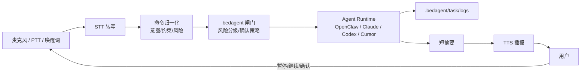

# bedagent 语音控制规划

> 场景：人在床上，不适合长时间看屏幕，但仍希望能指挥 Agent 做事、听到关键反馈、在高风险动作前做确认。
> 本文是产品能力规划，不是当前版本承诺。

## 一等公民：懒到极致的人

bedagent 的床上模式不是“给勤快用户多一种输入方式”，而是默认服务 **懒到极致的人**：

- 不想坐起来；
- 不想长时间盯屏幕；
- 不想打很多字；
- 不想看长日志；
- 不想维护复杂自动化；
- 只想一句话把事交代清楚，然后听关键结果。

所以语音控制不是附属功能，而是 bedagent 产品形态的一等公民。所有交互都要先问：**一个困在床上的懒人能不能用？**

## 一句话定位

bedagent 的语音能力不是“聊天机器人”，而是 **低屏幕任务遥控器**：

1. 用语音说目标；
2. Agent 复述理解和风险；
3. 用户用短口令确认、暂停、继续、取消；
4. 结果用极短语音汇报，详细日志留到屏幕端再看。

## 核心原则

| 原则 | 说明 |
|------|------|
| 懒人优先 | 默认少输入、少看屏、少维护；能自动推进就不要让用户盯着 |
| 少说 | 语音反馈默认 10-20 秒内，只读结论、风险、下一步 |
| 可打断 | 用户说“停一下 / 等等 / 暂停”必须立即停止朗读或执行下一步 |
| 高风险不静默 | 删除、付款、外发、push、生产变更必须二次确认 |
| 低置信度不执行 | STT 置信度低、环境噪声高、多人说话时，只能追问，不能猜 |
| 不读秘密 | API Key、密码、个人隐私不通过 TTS 读出；日志继续走脱敏 |
| 语音不是唯一凭证 | 声纹只能辅助识别，不能单独授权危险操作 |

## 床上模式交互协议

### 基础指令

| 口令 | 行为 |
|------|------|
| “bedagent，帮我...” | 创建任务草稿 |
| “复述一下” | Agent 用一句话复述目标、限制、验收标准 |
| “确认执行” | 执行当前低/中风险计划 |
| “暂停” | 停止执行下一步，保留状态 |
| “继续” | 从最近 checkpoint 恢复 |
| “取消任务” | 终止任务，写入取消原因 |
| “汇报进度” | 只播报当前状态、已完成、卡点 |
| “晚点再说” | 静默，只保留通知/日志 |

### 风险分级

| 风险 | 示例 | 语音策略 |
|------|------|----------|
| 绿 | 查资料、读代码、生成草稿 | 可直接执行，结束后短汇报 |
| 黄 | 多文件修改、安装依赖、长任务 | 先复述计划，用户说“确认执行”后执行 |
| 红 | 删除数据、推送远端、外发消息、付款、生产配置 | 必须二次确认：读出影响范围 + 要求用户说随机短句或改到屏幕端确认 |

红色任务不建议只靠语音完成。床上模式的目标是“少看屏幕”，不是“完全不看屏幕也能批准不可逆操作”。

## 建议架构

bedagent 应优先定义 **命令协议和闸门策略**，语音 I/O 可以换实现。

## 可复用技术栈调研

| 项目/方向 | 可借鉴点 | bedagent 采用建议 |
|-----------|----------|------------------|
| [Pipecat](https://github.com/pipecat-ai/pipecat) | 实时语音/多模态 Agent 管线，STT/TTS/传输层可插拔，支持多 Agent | 跨平台语音适配器候选；适合 v1.x+ 做独立 voice adapter |
| [TEN Framework](https://github.com/TEN-framework/TEN-framework) | 低延迟多模态会话、VAD/Turn Detection、WebSocket/RTC 示例 | 适合研究实时打断、轮次管理，不作为早期硬依赖 |
| [Kiwi Voice](https://github.com/ekleziast/kiwi-voice) | 面向 OpenClaw 的语音接口，唤醒词、声纹、barge-in、TTS、多语言 | OpenClaw 优先原型的最佳参考；可先做兼容指南 |
| openWakeWord + Faster Whisper + Piper/Kokoro | 本地唤醒词、本地 STT、本地 TTS | 隐私优先/离线模式候选，但维护成本高 |
| 系统级听写 / 浏览器语音输入 | 零集成成本 | MVP 可先支持：把语音转成文本后走现有 bedagent 流程 |

## 分阶段路线

### P0：语音命令契约（不接麦克风）

- 新增“床上模式”提示词：要求 Agent 回复短、先复述、分级确认。
- 定义 `voice_intent` 结构：`goal / constraints / risk / confirmation_required / summary_style`。
- 在 `task-aware.md` 中加入语音场景的低屏幕交互规则。
- 增加懒人验收标准：用户无需看长屏幕，也能知道“它要干什么 / 现在卡在哪 / 我该不该确认”。
- 验证方式：用户手动用系统听写输入，观察 Agent 是否少问、少输出、能确认。

### P1：OpenClaw 语音适配器

- 优先研究 Kiwi Voice 与 OpenClaw WebSocket/Gateway 的集成方式。
- 支持 push-to-talk 优先，唤醒词后置。
- 支持 TTS 短摘要：任务开始、等待确认、完成、失败四类事件。
- 所有语音输入写入 `.bedagent/task/logs`，带 STT 置信度和是否人工确认。

### P2：跨平台语音网关

- 评估 Pipecat / TEN 作为统一 voice adapter。
- 支持多运行时：OpenClaw、Claude Code、Codex、Cursor。
- 增加“床边设备”形态：手机/平板/旧电脑做语音遥控器，主机跑 Agent。

### P3：安全增强

- 声纹只做身份提示，不直接授权红色操作。
- 红色操作引入随机挑战短句、设备解锁、或屏幕端二次确认。
- 支持“夜间安静模式”：只震动/推送，不朗读敏感内容。

## 不做什么

- 不做通用语音助手；
- 不做情感陪伴；
- 不把长 diff、长日志读给用户听；
- 不允许语音单独批准不可逆高风险动作；
- 不在早期自研 STT/TTS 模型。

## 开放问题

1. 用户更偏好 push-to-talk 还是唤醒词？
2. 床上模式是否需要手机端作为确认器？
3. “红色任务”是否一律要求屏幕端确认？
4. 多人同处一室时，如何避免误触发？
5. 语音转写记录保留多久，是否默认脱敏/清理？
